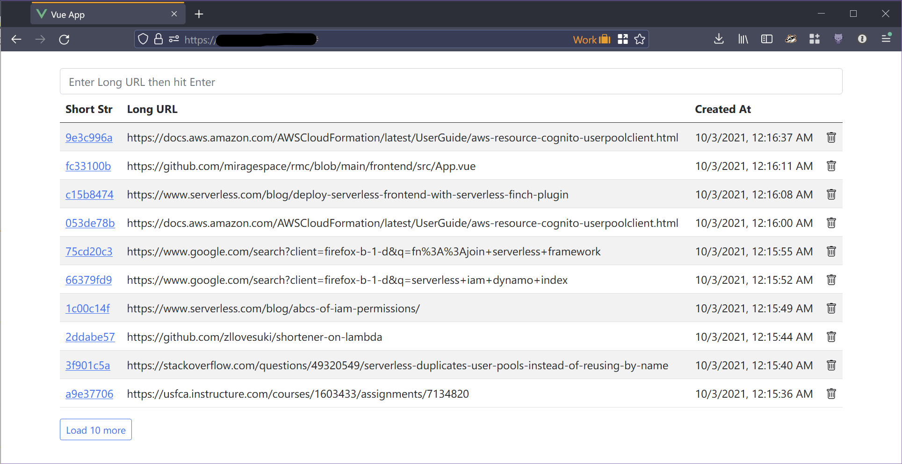

## What is this?

This repo hosts the the source code for the frontend in vuejs, and the backend powered by Lambda, to host an URL shortener.

The project was an exercise in patience of reading Amazon documentation, and learning how to use AWS services.

## How to deploy

It is recommended to have the domain of your choice hosted on Route 53.

### Backend

1. Setup AWS Cognito correctly. You may choose to use username/password or Google, but regardless, your user pool should already exist;
2. Rename `config.example.yml` to `config.yml`, and edit `userPoolId` and `userPoolARNs` to match the Cognito from step 1;
3. The shortener checks if the logged in user is allowed to create URLs by matching the domain part of the user email. Update `allowedDomainEmail` in `config.yml` to fit your needs. Note that `usfca.edu` with match with both `@usfca.edu` and `@dons.usfca.edu`;
4. Create 2 SSL certificates for the shortner. You can use AWS Certificate Manager for those domains.
    - one domain ("domain FE") will be used for the frontend on CloudFront via S3;
    - the other one ("domain API") will be used for the API Gateway.
5. Update `apiDomain` and `frontendDomain` in `config.yml` accordingly;
6. If you would like to use a different name for the DynamoDB table, update `Shortener` in `config.yml`;
7. run `npm install` for the serverless plugins. Install [serverless](https://www.serverless.com/) globally if you haven't already.
8. run `sls create_domain` so serverless can create custom domain in API Gateway for you
9. At this point, you should be ready to deploy the backend. Run `sls deploy --verbose`. This should finish without issues.
10. Head back to your Cognito user pool, then navigate to `App Integration`/`App client settings`, enable Identify Providers for the shortener client. If you use Google for your federation, enable Google, then save the changes.

### Frontend

Frontend setup requires manual intervention (because CloudFormation is hard to use). 

1. Navigate to `frontend/`, then rename `env.example` to `env`. Update fields accordingly:
    - If you use `api.example.com` as your `domain API`, then `VUE_APP_API` should be `https://api.example.com`
    - If you use `example.com` as your `domain FE`, then `VUE_APP_FRONTEND` should be `https://example.com/` (**the trailing slash is important**)
    - If you setup Cognito with a custom domain, then `VUE_APP_COGNITO_URL` will be `https://cognito.example.com`. Otherwise, use the default hosted UI domain from Cognito
    - `VUE_APP_COGNITO_CLIENT_ID` should match the user pool app client
2. Update `vue.config.js` accordingly:
    - This assumes that your aws credential is in `~/.aws/credentials`
    - If you want to use a different bucket name, feel free to change it
    - We will come back to configuring CloudFront invalidation later
3. run `npm install`, and have vue CLI installed globally. Then, run `env $(cat env | xargs) npm run build` to build the frontend
4. run `npm run deploy` to publish artifacts to S3
5. Create a new CloudFront distribution. This should point to the S3 bucket that `npm run deploy` just created for you. Make sure that "Default root object" is set to `index.html`
6. Configure your `domain FE` in Route 53 so that it points to the CloudFront distribution from step 5.
7. Now that we have a CloudFront distribution, update `vue.config.js` again, but with `enableCloudfront` set to `true,` and update `cloudfrontId` to the distribution from step 5. This allows for cache invalidation when you publish a new change to the FE.

Now you should be good to go.

